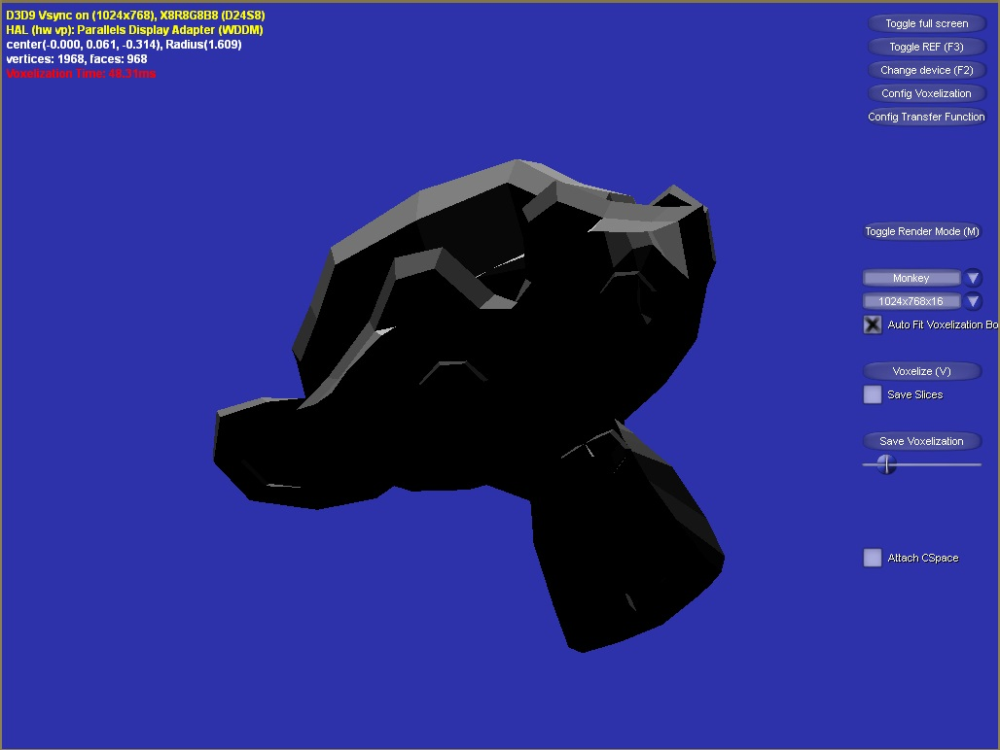
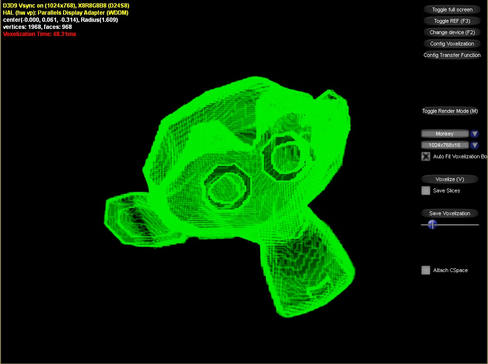
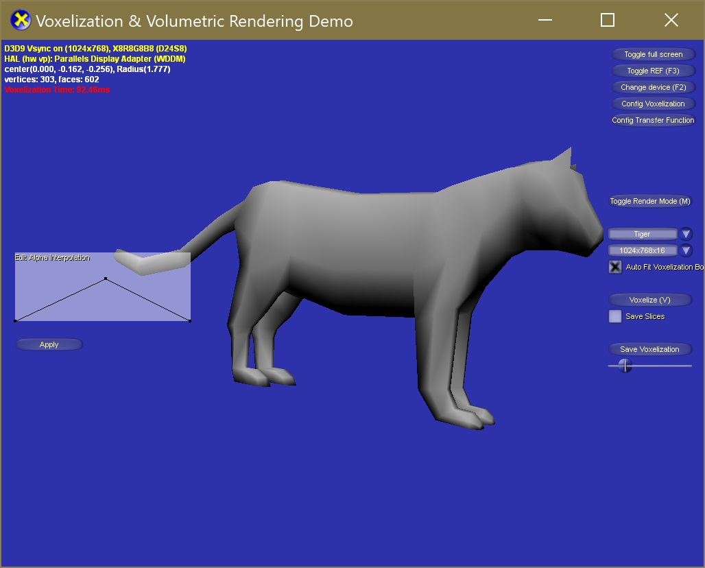
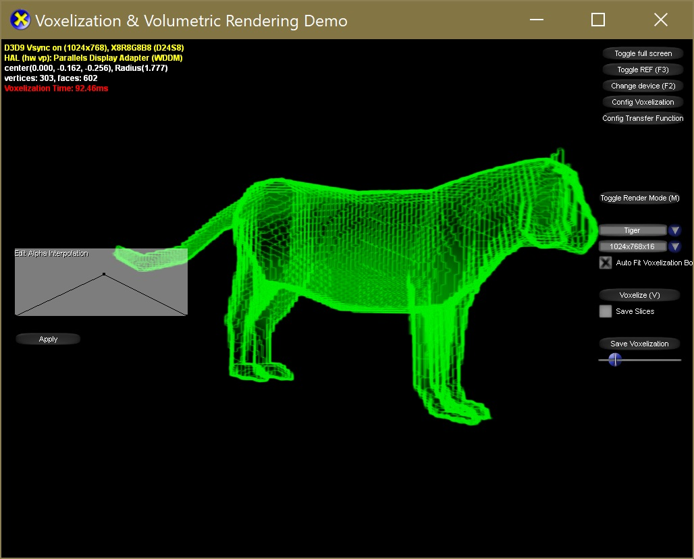
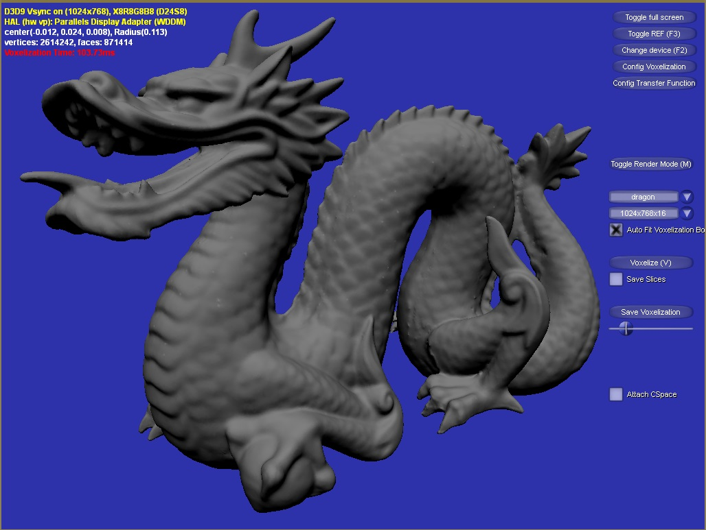
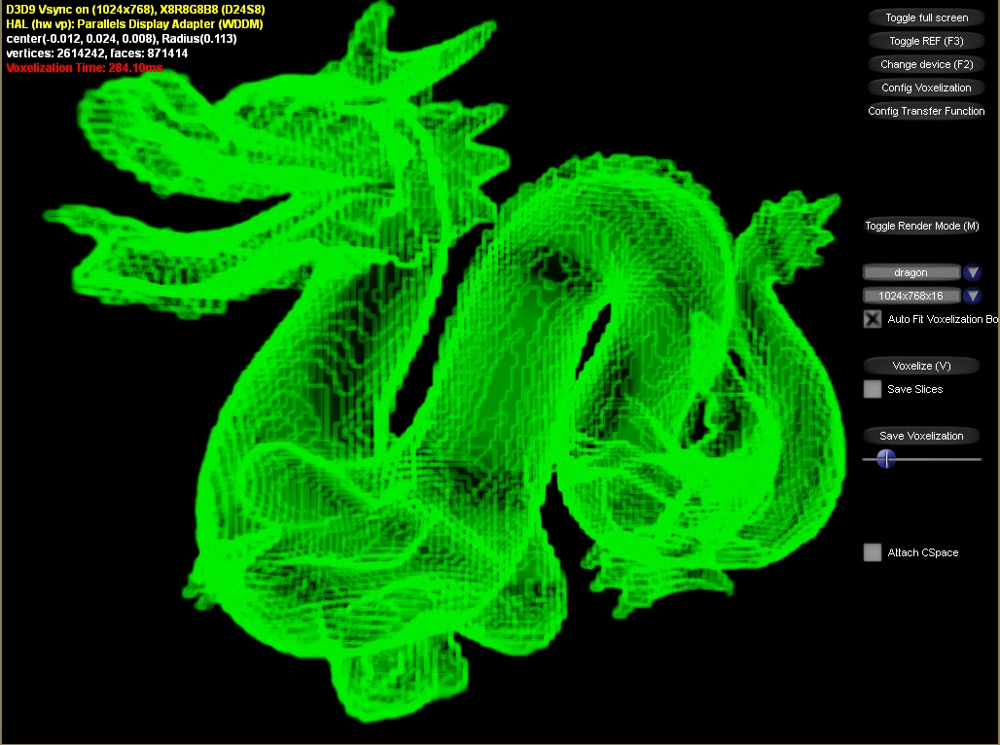
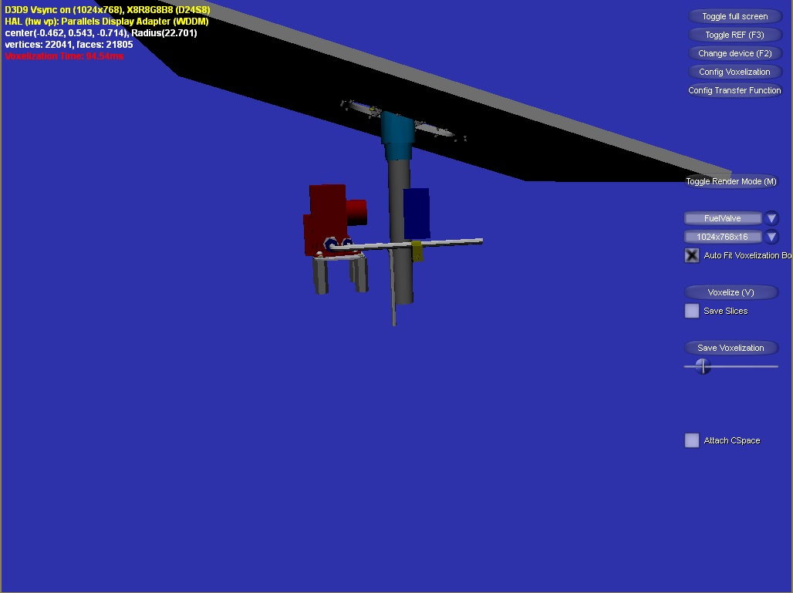
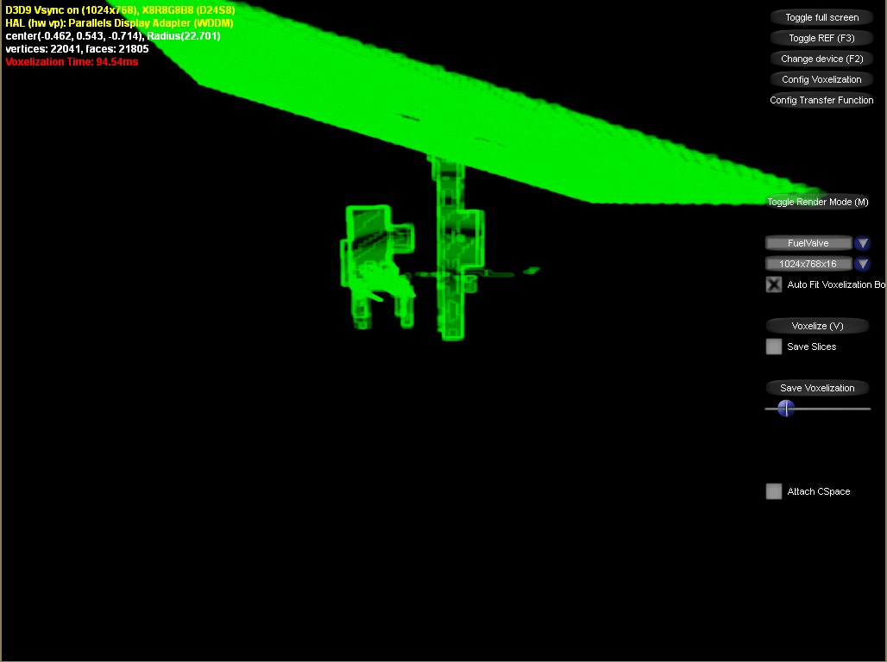

# VolRender

- [Introduction](#introduction)
- [Screenshots](#screenshots)
- [Building the project](#building)

# Introduction
A demo of performing voxelization on polygonal models then rendering the outcome of the voxelization using volumetric rendering technique implemented using C++, Win32, DirectX9 and HLSL.

# Screenshots
Polygon Rendering				|  Volumetric Rendering
:------------------------------:|:------------------------------:
  |
   |
  |
  |

# Building
To build this project you need to have [Microsoft DirectX SDK (June 2010)](https://www.microsoft.com/en-us/download/details.aspx?id=6812) installed on your system. The DXSDK_DIR environment variable is typically added by the installer.

